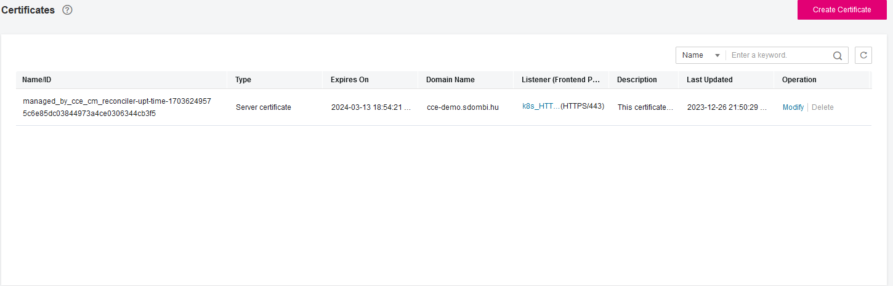
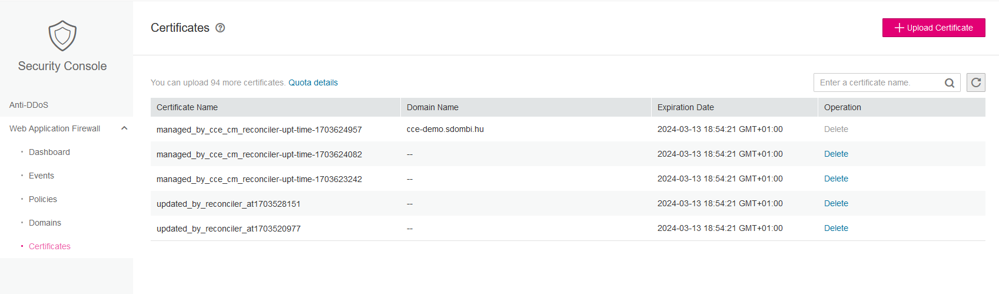

# CCE cert-manager certificate reconciler
This is a POC project to showcase how we can reconcile `letsencrypt` certificates for `ELB` and `WAF`  
It is using `kubeclient` to get the certificate directly from the `kube-api` and `gophertelekomcloud` aka OTC GO SDK to hit OTC APIs  

## Very high-level what is happening
The nice thing about cert-manager is that it renews the cert 30 days before `NotAfter` time by default. So there is no need for any hooks to do the cert update exactly at that time. We can just run this reconciler once a day as a kubernetes job to update the certificates in time.  
- get cert, key from kubernetes secret
- calculate expire time of the cert (directly from the cert object not from `certificate` CRD)
- get certificate expire time from ELB API
- compare
- reconcile if notAfterInSecret > notAfterInProvider
- get certificate expire time from WAF API
- compare
- create new certificate for WAF
- switch WAF to new certificate
- get out

# TODO LIST
- [ ] containerize
- [ ] GH actions for image building and hosting
- [ ] kubernetes cronjob
- [ ] helm chart
- [ ] `cm` as configuration
- [ ] secret for iam credentials 
- [ ] a real readme
- [ ] serviceaccounts and RBAC
- [X] add sharedELB
- [ ] add dedicatedWAF
- [ ] guardrails against users
- [ ] monitoring

# Example config for now

```
domains:
  - domain: cce-demo.sdombi.hu
    secretName: letsencrypt-demo-sdombi
    namespace: default
    elb: true
    wafId: 5c012ce68a124f77be4e7b6a447708e0
  - domain: nothing.sdombi.hu
    secretName: something
    namespace: something
    elb: false
    wafId: ""
```

# Example runs
## Cert is already latest:
```
./cce-cm-reconciler
2024/01/05 11:51:12 Building openstack.AuthenticatedClient was success.
2024/01/05 11:51:12 Building ELBCLient was success
2024/01/05 11:51:12 Building WAFClient was success
2024/01/05 11:51:12 Kubernetes clientset built
2024/01/05 11:51:12 [cce-demo.sdombi.hu] loaded secret 'letsencrypt-demo-sdombi' from 'default' namespace
2024/01/05 11:51:12 [cce-demo.sdombi.hu] certificate expire time in kubernetes secret: 2024-03-13T17:54:21Z
2024/01/05 11:51:13 [cce-demo.sdombi.hu] ELB certificate ID: 5c6e85dc03844973a4ce0306344cb3f5 
2024/01/05 11:51:13 [cce-demo.sdombi.hu] ELB certificate expire time 2024-03-13T17:54:21Z
2024/01/05 11:51:13 [cce-demo.sdombi.hu] provider for ELB has 2024-03-13T17:54:21Z expire time, Kubernetes secret has 2024-03-13T17:54:21Z no reconcile needed
2024/01/05 11:51:14 [cce-demo.sdombi.hu] WAF certificate expire time 2024-03-13T17:54:21Z
2024/01/05 11:51:14 [cce-demo.sdombi.hu] provider for WAF 5c012ce68a124f77be4e7b6a447708e0 has 2024-03-13T17:54:21Z expire time, Kubernetes secret has 2024-03-13T17:54:21Z no reconcile needed     
2024/01/05 11:51:14 [nothing.sdombi.hu] error getting secret something in namespace something secrets "something" not found
```

## Cert needs to be updated:
```
./cce-cm-reconciler --force
2024/01/05 11:51:42 Building openstack.AuthenticatedClient was success.
2024/01/05 11:51:42 Building ELBCLient was success
2024/01/05 11:51:42 Building WAFClient was success
2024/01/05 11:51:42 Kubernetes clientset built
2024/01/05 11:51:42 [cce-demo.sdombi.hu] loaded secret 'letsencrypt-demo-sdombi' from 'default' namespace
2024/01/05 11:51:42 [cce-demo.sdombi.hu] certificate expire time in kubernetes secret: 2024-03-13T17:54:21Z
2024/01/05 11:51:42 [cce-demo.sdombi.hu] FORCE MODE IS ON CERT WILL BE UPDATED IN THE PROVIDER
2024/01/05 11:51:42 [cce-demo.sdombi.hu] ELB certificate ID: 5c6e85dc03844973a4ce0306344cb3f5 
2024/01/05 11:51:42 [cce-demo.sdombi.hu] ELB certificate expire time 2024-03-13T17:54:21Z
2024/01/05 11:51:42 [cce-demo.sdombi.hu] certificate's notAfter in kubernetes secret is later than in provider, attempting to reconcile certificate for ELB
2024/01/05 11:51:43 [cce-demo.sdombi.hu] ELB certificate successfully updated
2024/01/05 11:51:44 [cce-demo.sdombi.hu] WAF certificate expire time 2024-03-13T17:54:21Z
2024/01/05 11:51:44 [cce-demo.sdombi.hu] certificate's notAfter in kubernetes secret is newer than in provider, should reconcile certificate for WAF 5c012ce68a124f77be4e7b6a447708e0
2024/01/05 11:51:44 [cce-demo.sdombi.hu] created new WAF certificate with ID: 56ba313ec5f645b4b55feffa3dc0ef93
2024/01/05 11:51:45 [cce-demo.sdombi.hu] WAF certificate has been updated
2024/01/05 11:51:45 [nothing.sdombi.hu] error getting secret something in namespace something secrets "something" not found
```

### ELB updated by the reconciler


### WAF updated by the reconciler

